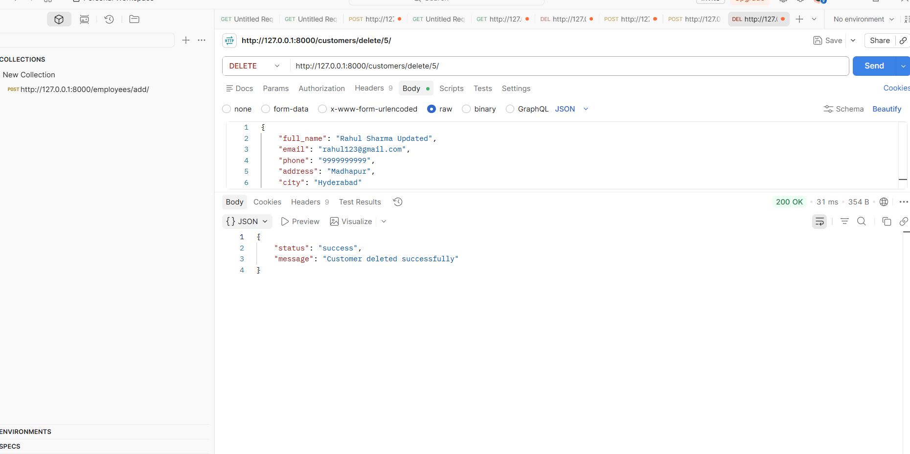
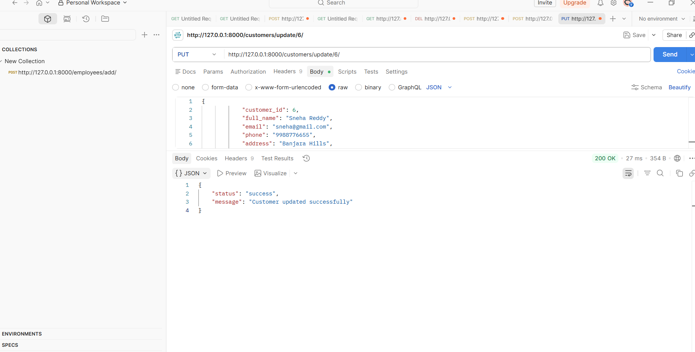

# Food Delivery Application

A complete, production-ready Full Stack Food Delivery Application exactly matching the university specifications. Built with HTML5, CSS3 (Glassmorphism), JavaScript (Fetch API), and Django (Function-Based Views and SQLite).

## Technology Stack
- **Frontend:** HTML5, CSS3, JavaScript ES6 (Fetch API)
- **Backend:** Python 3, Django 4.x (REST APIs via JsonResponse)
- **Database:** SQLite

## Installation & Setup

1. **Activate Virtual Environment** (If applicable):
   ```bash
   python -m venv venv
   source venv/bin/activate  # On Windows: venv\Scripts\activate
   ```

2. **Install Requirements**:
   ```bash
   pip install -r requirements.txt
   ```

3. **Navigate to Backend Directory**:
   ```bash
   cd Backend
   ```

4. **Database Migration Commands**:
   ```bash
   python manage.py makemigrations
   python manage.py migrate
   ```

5. **Populate Sample Data** (Important for beautiful UI testing!):
   ```bash
   python populate.py
   ```

6. **Run Server**:
   ```bash
   python manage.py runserver
   ```

## Frontend Pages
- Simply double click `Frontend/index.html` in your browser.
- **Pages Included:** `index.html`, `login.html`, `register.html`, `restaurants.html`, `menu.html`, `cart.html`, `orders.html`, `dashboard.html`.

## GitHub Upload Steps
1. Initialize Git: `git init`
2. Add files: `git add .`
3. Commit: `git commit -m "Initial commit of Food Delivery App"`
4. Link to GitHub: `git remote add origin <your-github-repo-url>`
5. Push: `git push -u origin master`

## Screenshots

### Application UI


### API & Database Testing



